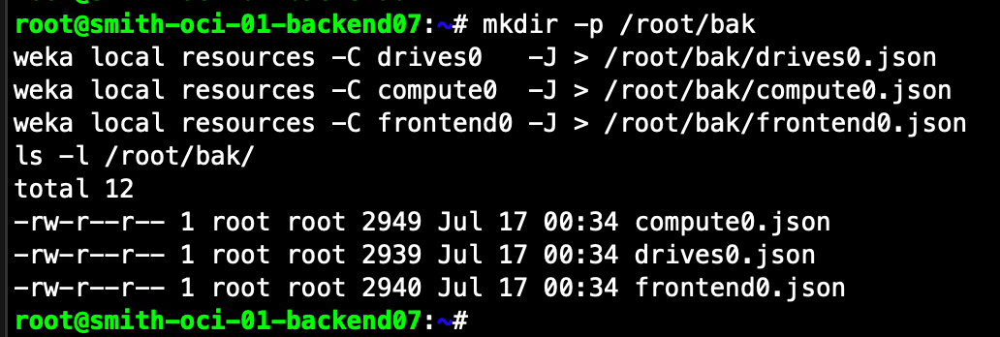
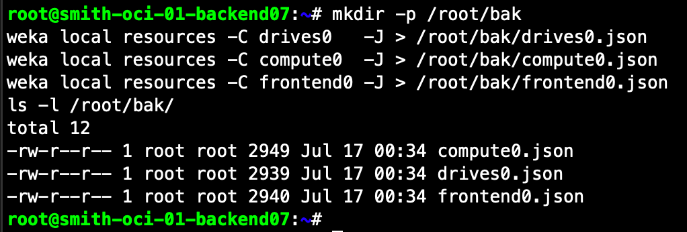
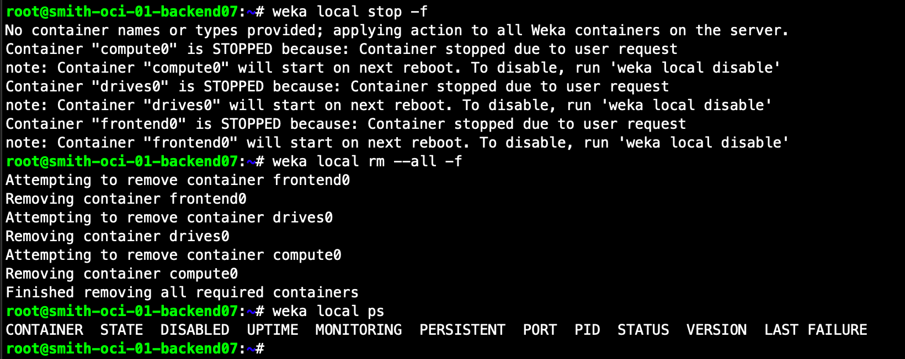
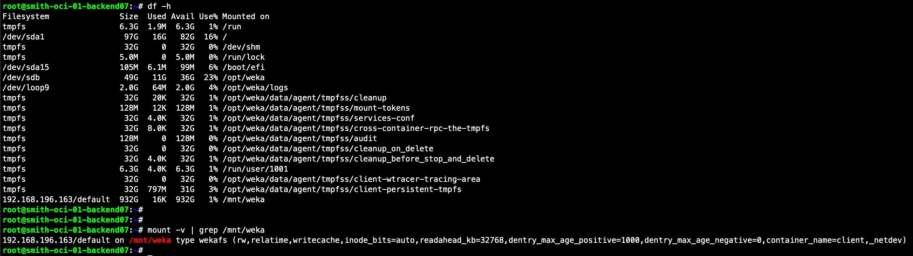
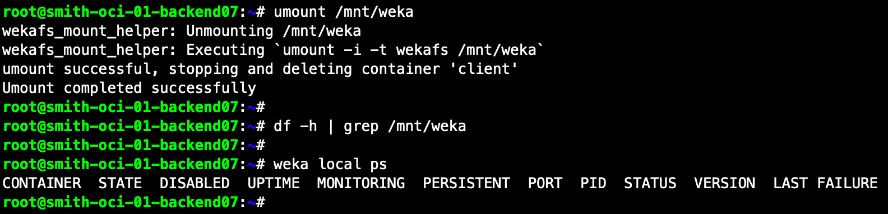
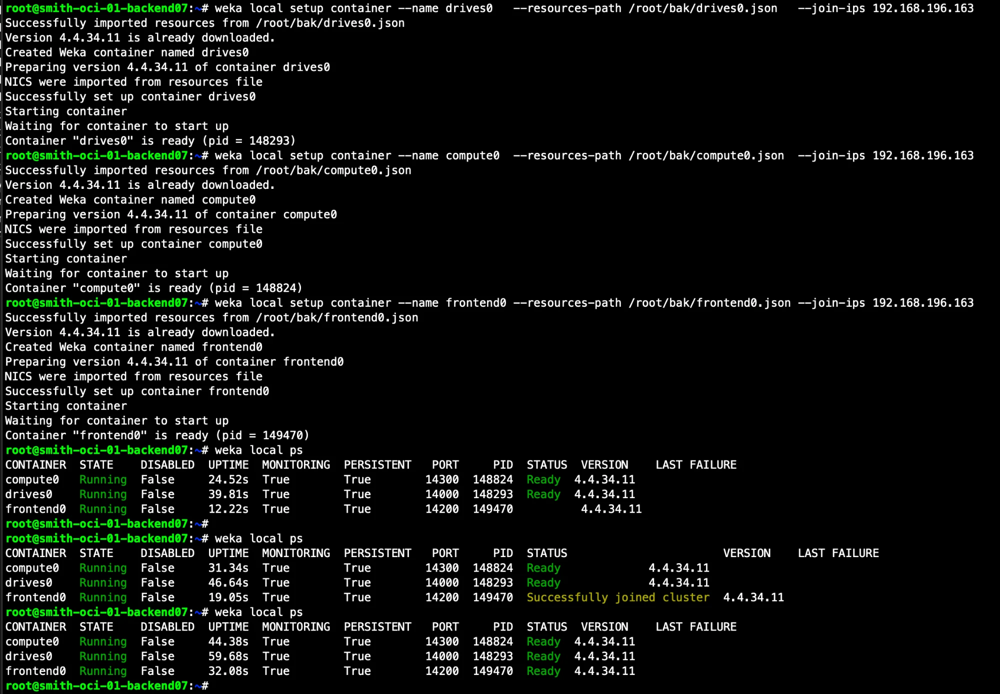

# WEKA-on-OCI: 백엔드를 임시로 Client로 mount 후 복원 (MOP)

WEKA 백엔드(BE) 노드를 잠시 stateless client로 전환해 파일시스템을 mount/테스트한 뒤, 다시 backend로 복원하는 수동 절차입니다. OCI 환경(7 BE, 3+2, hotspare 1)에서 검증했습니다.

> **환경 값은 예시입니다. 본인 클러스터 값으로 교체하세요.**
> - control = `backend01` (클러스터 명령 실행 노드) · target = `backend07` (client로 전환할 대상)
> - control 사설 IP `192.168.196.163` · target 관리 IP `192.168.196.133` · 파일시스템 `default`
> - 데이터 디바이스 `/dev/sdc`, `/dev/sdd` (환경마다 다름 — `lsblk`로 확인)
> - admin 비밀번호는 `<ADMIN_PW>` 로 표기 · SSH 키 `~/.oci/id_rsa` (login `ubuntu`, root는 `sudo -i`)

표기: **[C]** = control(backend01)에서, **[T]** = target(backend07)에서. 모두 root 기준.

**작업 순서:** ① 클러스터에서 target 드라이브를 먼저 정식 제거(deactivate→remove) → ② target 로컬 컨테이너 제거 → ③ client mount/IO → ④ umount → ⑤ 백업 JSON으로 backend 복원 + 드라이브 재추가. 드라이브를 먼저 깔끔히 빼두면 뒤에 stale 드라이브를 따로 정리할 필요가 없습니다. 3+2 + hotspare 1이 target 다운을 흡수하므로 클러스터는 계속 protected.

---

## Step 0. 접속
```bash
# [로컬 PC]
ssh -i ~/.oci/id_rsa ubuntu@<backend01_PUBLIC_IP>     # control 세션
ssh -i ~/.oci/id_rsa ubuntu@<backend07_PUBLIC_IP>     # target 세션
# 각 세션에서
sudo -i
```

## Step 1. Baseline 확인 + target 드라이브 UUID 파악  [C]
```bash
weka status
weka cluster drive | grep backend07     # target 드라이브의 DISK ID / UUID 확인 (보통 ACTIVE 2개)
```
기대: `status: OK`, `Fully protected`, `hot spare: 1 ...`. target 드라이브 UUID를 메모(Step 3에서 사용).



## Step 2. target 설정 백업 (복원용, 반드시 먼저)  [T]
```bash
mkdir -p /root/bak
weka local resources -C drives0   -J > /root/bak/drives0.json
weka local resources -C compute0  -J > /root/bak/compute0.json
weka local resources -C frontend0 -J > /root/bak/frontend0.json
ls -l /root/bak/
```
기대: `drives0.json compute0.json frontend0.json` 3개 생성 (NIC·코어·sw_A/sw_B 라벨 포함).



## Step 3. 클러스터에서 target 드라이브 제거 (deactivate → remove)  [C]
target의 각 드라이브 UUID에 대해 `deactivate` 후 `remove`. (`yes/no` 프롬프트 — 자동화 시 `--force`)
```bash
weka cluster drive | grep backend07                         # 대상 UUID 확인

# 드라이브별로 deactivate (phasing out) → remove
weka cluster drive deactivate <UUID>                        # 예: 842fbb22-d23f-4527-9c66-d0be78b3a369
weka cluster drive remove     <UUID>
weka cluster drive deactivate <UUID2>                       # 두 번째 데이터 드라이브
weka cluster drive remove     <UUID2>

weka cluster drive | grep backend07                         # target 드라이브가 사라졌는지 확인
```
> - `deactivate` 하면 해당 드라이브 `STATUS=INACTIVE`, `NODE ID=INVALID` → `remove` 로 클러스터에서 완전 제거.
> - UUID 대신 DISK ID도 가능. 확인 없이 진행하려면 `--force`.
> - ⚠️ **용량 주의:** ACTIVE 드라이브 deactivate는 데이터를 다른 드라이브로 phase-out함. `default` FS 예산이 남는 용량보다 크면 `error: ... less than the total budget for filesystems (rc50)` 로 거부됨 → 이 경우 `weka fs update default --total-capacity <작게>` 로 **FS 먼저 축소**. (unprovisioned 여유가 있으면 그냥 통과)

## Step 4. Detach — target 로컬 컨테이너 제거  [T]
```bash
weka local stop -f
weka local rm --all -f
weka local ps
```
기대: `weka local ps` 결과가 **헤더만**(컨테이너 0개). 이 시점에 데이터 NIC(enp1~7)이 커널로 복귀.



## Step 5. Client로 mount  [T]
### 5-1. 데이터 NIC / IP 확인
```bash
mkdir -p /mnt/weka
ip -4 -o addr show | grep -oE 'enp[0-9]+s[0-9]+ +.*192\.168\.196\.[0-9]+'
```
관리용 `enp0s9`(예: `192.168.196.133`)는 제외하고, 나머지 데이터 NIC/IP를 확인.

### 5-2. mount 실행 (위에서 확인한 NIC/IP를 `-o net=` 줄에 기입)
```bash
mount -t wekafs \
  -o mgmt_ip=192.168.196.133 \
  -o net=enp1s0/192.168.196.159/25 \
  -o net=enp2s0/192.168.196.xxx/25 \
  -o net=enp3s0/192.168.196.xxx/25 \
  -o net=enp4s0/192.168.196.253/25 \
  -o net=enp5s0/192.168.196.194/25 \
  -o net=enp6s0/192.168.196.xxx/25 \
  -o net=enp7s0/192.168.196.173/25 \
  -o num_cores=3,_netdev \
  192.168.196.163/default /mnt/weka
```
> `192.168.196.163` = control(backend01) 사설 IP, `/default` = FS. `xxx`는 5-1 확인값으로 교체.
> 기대 로그: `wekafs_mount_helper: ... Mount completed successfully`

### 5-3. 확인  [T]
```bash
grep /mnt/weka /proc/mounts
weka local ps
```
기대: wekafs 마운트 존재, `client` 컨테이너 `Running`.



## Step 6. IO 테스트 (fio)  [T]
`/mnt/weka/fio`에 fio로 seq/rnd × read/write 4종을 각 60초 수행. (fio 미설치 시 `apt-get install -y fio`)
```bash
mkdir -p /mnt/weka/fio
```

**seq-r — 순차 읽기 (1Mi, iodepth=1, numjobs=96)**
```bash
fio --directory=/mnt/weka/fio --filesize=1G --direct=1 --ioengine=posixaio \
    --time_based=1 --runtime=60 --startdelay=5 --ramp_time=3 \
    --fallocate=none --create_serialize=0 --invalidate=1 --exitall_on_error=1 \
    --clocksource=gettimeofday --disk_util=1 --group_reporting=1 --filename_format='$jobnum' \
    --name=seq-r --rw=read --blocksize=1Mi --iodepth=1 --numjobs=96
```
**seq-w — 순차 쓰기 (1Mi, iodepth=1, numjobs=96)**
```bash
fio --directory=/mnt/weka/fio --filesize=1G --direct=1 --ioengine=posixaio \
    --time_based=1 --runtime=60 --startdelay=5 --ramp_time=3 \
    --fallocate=none --create_serialize=0 --invalidate=1 --exitall_on_error=1 \
    --clocksource=gettimeofday --disk_util=1 --group_reporting=1 --filename_format='$jobnum' \
    --name=seq-w --rw=write --blocksize=1Mi --iodepth=1 --numjobs=96
```
**rnd-r — 랜덤 읽기 (4k, iodepth=16, numjobs=256)**
```bash
fio --directory=/mnt/weka/fio --filesize=1G --direct=1 --ioengine=posixaio \
    --time_based=1 --runtime=60 --startdelay=5 --ramp_time=3 \
    --fallocate=none --create_serialize=0 --invalidate=1 --exitall_on_error=1 \
    --clocksource=gettimeofday --disk_util=1 --group_reporting=1 --filename_format='$jobnum' \
    --name=rnd-r --rw=randread --blocksize=4k --iodepth=16 --numjobs=256
```
**rnd-w — 랜덤 쓰기 (4k, iodepth=16, numjobs=256)**
```bash
fio --directory=/mnt/weka/fio --filesize=1G --direct=1 --ioengine=posixaio \
    --time_based=1 --runtime=60 --startdelay=5 --ramp_time=3 \
    --fallocate=none --create_serialize=0 --invalidate=1 --exitall_on_error=1 \
    --clocksource=gettimeofday --disk_util=1 --group_reporting=1 --filename_format='$jobnum' \
    --name=rnd-w --rw=randwrite --blocksize=4k --iodepth=16 --numjobs=256
```
> 옵션은 저장소의 [`fio.job`](fio.job) 기준. `stonewall`은 단일 실행이라 생략, `filename_format=$jobnum`은 셸 확장 방지로 작은따옴표.
> 기대: 각 실행 끝에 `READ:`/`WRITE:` bw·IOPS 요약 출력 (seq=대역폭, rnd=IOPS 관점).

## Step 7. Umount  [T]
```bash
umount /mnt/weka
df -h | grep /mnt/weka        # 출력 없어야 함
weka local ps                 # 헤더만
```
> `umount`이 **`client` 컨테이너를 자동 stop+delete** 합니다("umount successful, stopping and deleting container 'client'"). 별도 `weka local rm client -f`는 불필요(잔여 시에만).



## Step 8. Re-add — target를 backend로 복원  [T]
### 8-1. 데이터 드라이브 확인 후 wipe (stale 시그니처 제거)
```bash
lsblk -d -o NAME,SIZE,MOUNTPOINT
# 300G 2개가 데이터 (예: /dev/sdc, /dev/sdd; sda=boot, sdb=/opt/weka)
wipefs -a /dev/sdc /dev/sdd
sgdisk --zap-all /dev/sdc /dev/sdd
partprobe /dev/sdc /dev/sdd
```

**Production (베어메탈 NVMe, 예: nvme 10개)** — `blkdiscard`로 초기화:
```bash
for i in {1..10};do echo blkdiscard /dev/nvme${i}n1;blkdiscard /dev/nvme${i}n1; sleep 1;done
```
> ⚠️ `blkdiscard`는 되돌릴 수 없음. 실행 전 `lsblk`로 **데이터 NVMe 범위(nvme1~10 등)와 OS/부팅 디스크가 겹치지 않는지** 반드시 확인. (OS가 `nvme0n1`이면 데이터는 nvme1~10)

### 8-2. 백업 JSON으로 컨테이너 재생성 + join
```bash
weka local setup container --name drives0   --resources-path /root/bak/drives0.json   --join-ips 192.168.196.163
weka local setup container --name compute0  --resources-path /root/bak/compute0.json  --join-ips 192.168.196.163
weka local setup container --name frontend0 --resources-path /root/bak/frontend0.json --join-ips 192.168.196.163
weka local ps
```
기대: `NICS were imported from resources file` → 3개 컨테이너 `Running`, `Successfully joined cluster` 후 `Ready`.



### 8-3. 새 drives0 컨테이너 ID 확인 후 드라이브 재추가  [C]
```bash
weka cluster container | grep backend07 | grep drives0    # 맨 앞 숫자 = 새 drives0 ID (예: 28)
weka cluster drive add 28 /dev/sdc /dev/sdd --CONNECT-TIMEOUT 10s --TIMEOUT 60s
weka status rebuild
weka status
```
기대: `drive add` 직후 `status: REBUILDING` → 재분산 완료 후 `status: OK (21 backend containers UP, 14 drives UP)`, `Fully protected` 복귀.

---

## 부록 — 핵심 발견 / 함정
- **`weka local stop`만으론 client mount 불가**: WEKA는 한 호스트에 backend + stateless client 공존을 금지(`does not support mixing...`). client 포트를 바꿔도 동일(역할 검사, 포트 무관). → **`weka local rm --all -f`** 로 backend 컨테이너를 없애야 client mount 가능.
- **드라이브 제거는 `deactivate` → `remove` (UUID/ID)**: deactivate로 phase-out(INACTIVE, NODE INVALID) 후 remove. detach 전에 미리 빼두면 재-add 후 stale 드라이브를 따로 정리할 필요가 없음.
- **드라이브 deactivate 블로커 2종**:
  - backend 수가 스트라이프 폭에 빠듯하면(예: 6 BE에서 3+2) FD 부족으로 **hang**.
  - `default` FS 예산이 남는 용량보다 크면 **`rc50` 거부** → `weka fs update`로 FS 먼저 축소. (unprovisioned 여유 있으면 통과)
- **re-add**: 백업 JSON은 컨테이너(NIC/코어/sw_A·sw_B 라벨)만 복원 → **드라이브는 `weka cluster drive add`로 별도 추가**. 재추가 전 **wipe** 필수(stale 시그니처).
- **umount이 client 컨테이너 자동 제거**.
- cluster 명령이 hang하면 `--CONNECT-TIMEOUT 10s --TIMEOUT 60s` 를 붙일 것.
